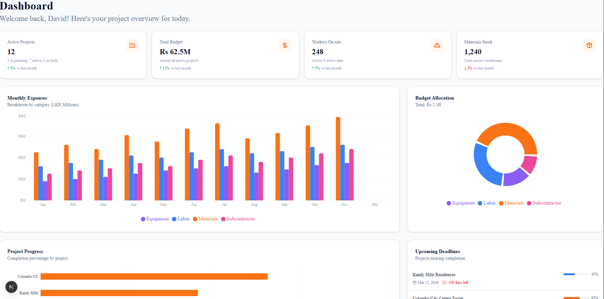

# BuidPro - Construction Project Management



A full-Stack web application for managing construction projects, built with **Next.js 16**, **React 19**, **TypeScript**, **Tailwindcss**, **shadcn/ui**, **Recharts**, **Supabase**.

## Features

- **Dashboard** – Real‑time overview of active projects, budgets, and workers.
- **Project Management** – Create, edit, and track projects with status, timelines, and budgets.
- **Budget & Expense Tracking** – Record expenses by category, monitor spending against budget with visual charts.
- **Material Management** – Track inventory (ordered, used, remaining) and low‑stock alerts.
- **Worker & Attendance** – Register workers, mark daily attendance with statuses (Present, Absent, Half‑Day, Overtime).
- **Document Storage** – Upload, download, and manage project files (plans, permits, photos).
- **Reports & Analytics** – Printable project and global reports with interactive charts (budget vs actual, expense breakdown, attendance distribution).
- **Authentication & Multi‑User** – Secure login/signup with Row Level Security (RLS) – users only see projects they belong to.
- **Responsive Design** – Desktop‑first, fully responsive for tablets and mobiles.

## Tech Stack

| Category     | Technology                                                             |
| ------------ | ---------------------------------------------------------------------- |
| Frontend     | Next.js 16 (App Router), React 19, TypeScript, Tailwind CSS, shadcn/ui |
| Charts       | Recharts                                                               |
| Backend / DB | Supabase (PostgreSQL, Auth, Storage, Realtime)                         |
| State Mgmt   | TanStack Query (React Query)                                           |
| Forms        | React Hook Form + Zod (validators ready)                               |
| Deployment   | Vercel (frontend) + Supabase (backend)                                 |

## Getting Started

This is a [Next.js](https://nextjs.org) project bootstrapped with [`create-next-app`](https://nextjs.org/docs/app/api-reference/cli/create-next-app).

## Getting Started

First, run the development server:

```bash
npm run dev
# or
yarn dev
# or
pnpm dev
# or
bun dev
```

Open [http://localhost:3000](http://localhost:3000) with your browser to see the result.

You can start editing the page by modifying `app/page.tsx`. The page auto-updates as you edit the file.

This project uses [`next/font`](https://nextjs.org/docs/app/building-your-application/optimizing/fonts) to automatically optimize and load [Geist](https://vercel.com/font), a new font family for Vercel.

## Learn More

To learn more about Next.js, take a look at the following resources:

- [Next.js Documentation](https://nextjs.org/docs) - learn about Next.js features and API.
- [Learn Next.js](https://nextjs.org/learn) - an interactive Next.js tutorial.

You can check out [the Next.js GitHub repository](https://github.com/vercel/next.js) - your feedback and contributions are welcome!

## Deploy on Vercel

The easiest way to deploy your Next.js app is to use the [Vercel Platform](https://vercel.com/new?utm_medium=default-template&filter=next.js&utm_source=create-next-app&utm_campaign=create-next-app-readme) from the creators of Next.js.

Check out our [Next.js deployment documentation](https://nextjs.org/docs/app/building-your-application/deploying) for more details.
